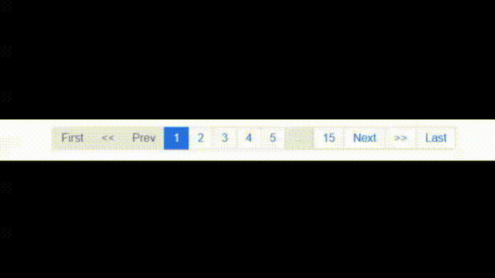
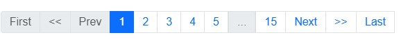
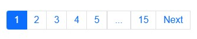
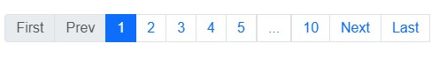
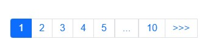
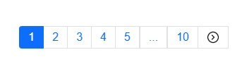
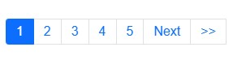
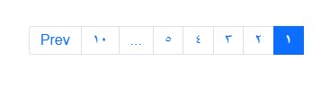
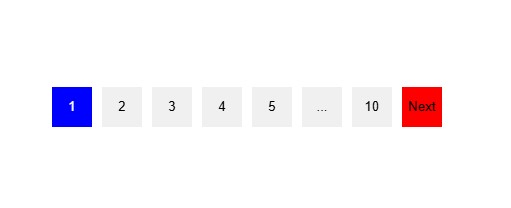

# Z Vue Pagination

#### _The Vue.js 3 Pagination Library_



[](https://github.com/bilaldanny/z-vue-pagination "Go to GitHub repo")

[](http://badge.fury.io/js/z-vue-pagination) [](http://badge.fury.io/js/z-vue-pagination) [](https://github.com/bilaldanny/z-vue-pagination/blob/main/LICENSE)

Z Vue Paginate is a modern and powerfull vue js pagination library with a large set of various pagination components that are flexible, very lightweight, SEO friendly, customizable with pure CSS and very easy to use.

## Key Features

- All pagination functionalities are built in to the package with 0 dependants.

- Various different types of pagination components that you can enable or disable according to your needs, and what suits your website best.

- Complete customization support for every component using pure CSS.

- Complete RTL support.

- Search Engine Optimization friendly.

- Different localizations support.

- Package is built with typescript and vite with complete support for vue.js (3x)

&nbsp;

# Table of Contents

- [**_Demo_**](#demo)

- [**_Requirements_**](#requirements)

- [**_Installation_**](#installation)

- [**_Vue.js_**](#vuejs)

- [**_Usage_**](#usage)

- [**_API_**](#api)

- [**_Component Attributes_**](#Component-Attributes)

- [**_Class Name Attributes_**](#Class-Name-Attributes)

- [**_Slot Names_**](#Slot-Names)

- [**_Events_**](#Events)

- [**_Author_**](#author)

- [**_License_**](#license)

&nbsp;


## Requirements

This package supports vue.js, you are required to use:

- Vue.js 3.x

&nbsp;

## Installation

To use the package you must first add the it to your dependencies in your project.

```bash

$  npm  i  z-vue-pagination

```

Then you have to register the package in your project as well as import a necessary css file that comes with the package.

### Vue.js

Global Import Component

```javascript
import { createApp } from "vue";

import App from "./App.vue";

// import the package

import ZVuePagination from 'z-vue-pagination';

// Register the package

createApp(App).use(ZVuePagination).mount("#app");
```

Local Import Component

```javascript
import ZVuePagination from 'z-vue-pagination';

// Register the package

export default {
  ...
  components: {
    ZVuePagination
  }
  ...
}
```

&nbsp;

## Usage

A complete z-vue-pagination component example with some custom CSS customization would be like this:

```html
<script setup lang="ts">
  import {ref} from 'vue'

  const onClickHandler = (page: number) => {
    console.log(page);
  };

  const currentPage = ref(1);
  const totalItems = 150;
  const perPage = 10;
</script>

<template>
  <z-vue-pagination 
    :totalItems="totalItems"
    :items-per-page="perPage"
    :max-pages-shown="5"
    v-model="currentPage"
    :showDisabled="true"
    :disableBreakpointButtons="true"
    :showEndingButtons="true"
    :showJumpButtons="true"
    @click="onClickHandler"
  />
</template>
```

##### Result of the above code:



&nbsp;

&nbsp;

&nbsp;

&nbsp;

## Required Attributes

Total required attributes to build a full pagination for your website is only two attributes, the component will handle all the other functionalities and attributes by default

as simple as this example:

```html
<z-vue-pagination :total-items="200" v-model="currentPage" />
```

##### Result of the above code:



&nbsp;

&nbsp;

&nbsp;

&nbsp;

## Configurations

You have total control over your pagination component, you can configure every element's appearence, number and behavior.

Example: you can set items per single page, maximum pagination buttons to show and a click event handler.

```html
<z-vue-pagination
  :total-items="50"
  v-model="currentPage"
  :items-per-page="5"
  :max-pages-shown="5"
  @click="onClickHandler"
/>
```

##### Result of the above code:


&nbsp;

&nbsp;

&nbsp;

&nbsp;

## (Show/Hide) or (Enable/Disable) breakpoint buttons

Breakpoint buttons are clickable and shown by default, if you click on them you will get a jump of max-pages-shown / 2 in the pagination

You can Disable/Enable or Hide/Show them through attributes

```html
<!-- Hide Breakpoint Buttons -->

<z-vue-pagination
  :total-items="50"
  v-model="currentPage"
  :items-per-page="5"
  :max-pages-shown="5"
  :showBreakpointButtons="true"
  @click="onClickHandler"
/>

<!-- Disable Breakpoint Buttons -->

<z-vue-pagination
  :total-items="50"
  v-model="currentPage"
  :items-per-page="5"
  :max-pages-shown="5"
  @click="onClickHandler"
  :disableBreakpointButtons="true"
/>
```

&nbsp;

&nbsp;

&nbsp;

## Show Ending Buttons (First and Last Page Buttons)

You can hide/show Ending buttons to be able to navigate to first and last page of the pagination component

```html
<!-- Hide the Prev/Next buttons permanently -->

<z-vue-pagination
  :total-items="50"
  v-model="currentPage"
  :items-per-page="5"
  :max-pages-shown="5"
  :showEndingButtons="true"
  :showDisabled="true"
/>
```

##### Result of the above code:



&nbsp;

&nbsp;

&nbsp;

&nbsp;

## Hide Prev/Next buttons

You can hide prev/next buttons in two ways

```html
<!-- Hide the Prev/Next buttons permanently -->

<z-vue-pagination
  :total-items="50"
  v-model="currentPage"
  :items-per-page="5"
  :max-pages-shown="5"
  @click="onClickHandler"
  :hide-prev-next="true"
/>

<!-- Hide the Prev button only when pagination is at the beginning and hide next button only when pagination reaches the end -->

<z-vue-pagination
  :total-items="50"
  v-model="currentPage"
  :items-per-page="5"
  :max-pages-shown="5"
  @click="onClickHandler"
  :hide-prev-next-when-ends="true"
/>
```

##### Result of the above code:


&nbsp;

&nbsp;

&nbsp;

&nbsp;

## Change buttons content

You can change the content inside the prev/next buttons in two ways:

1- Pass a string to **prev-button-content** or **next-button-content** attributes

```html
<z-vue-pagination
  :total-items="50"
  v-model="currentPage"
  :items-per-page="5"
  :max-pages-shown="5"
  @click="onClickHandler"
  prev-button-content="<<<"
  next-button-content=">>>"
/>
```

##### Result of the above code:



&nbsp;

&nbsp;

2- Inject your own HTML content into the buttons through custom slots

```html
<z-vue-pagination
  :total-items="50"
  v-model="currentPage"
  :items-per-page="5"
  :max-pages-shown="5"
  @click="onClickHandler"
>
  <template #prev-button>
    <span>
      
    </span>
  </template>

  <template #next-button>
    <span>
      
    </span>
  </template>
</z-vue-pagination>
```

##### Result of the above code:



&nbsp;

&nbsp;

&nbsp;

&nbsp;

## Custom Slots

**This 2nd method of injecting html through custom slots in to elements in the previous example is available for all the other controlling elements like breakpoint buttons and jump buttons etc...**

You can see all the slots in the slots table at API section

&nbsp;

&nbsp;

&nbsp;

&nbsp;

## Show Jump Buttons

Jump Buttons are extra layers on top of Prev/Next buttons, if you enable them they will appear at each ends of the component, you can customize and configure them just like any other elements of the component and if you click on them it will have the same behavior as clicking on breakppoint buttons which is jumping by (max-pages-show/2)

```html
<z-vue-pagination
  :total-items="50"
  v-model="currentPage"
  :items-per-page="5"
  :max-pages-shown="5"
  :showBreakpointButtons="false"
  :showJumpButtons="true"
/>
```

##### Result of the above code:



&nbsp;

&nbsp;

&nbsp;

&nbsp;

## Make the component SEO friendly

Pagination components can have a great impact on SEO, it's important to make your pagination elements links, so that when crawlers crawl your page, they will be able to find the pagination elements and extract the links from them.

In order to achive this you can replace the button elements with anchor tag elements by changing **type** attribute to "link" and specify a **linkUrl** attribute to tell crawlers and search engines where this pagination element is pointing to.

**linkUrl** attribute must be a string url to where the pagination element is pointing to, and the string must include \[page\] placeholder, which will be replaced with the actual page number.

example:

```html
<z-vue-pagination
  :total-items="50"
  v-model="currentPage"
  :items-per-page="5"
  :max-pages-shown="5"
  @click="onClickHandler"
  type="link"
  link-url="/blog/posts?page=[page]"
/>
```

**Note:** Changing buttons to anchor tags won't affect the functionality or the behavior of the component, it's just a way to make the component SEO friendly. you will still have to handle the navigation logic yourself in **on-click** event attribute.

&nbsp;

&nbsp;

&nbsp;

&nbsp;

## RTL and Locale Support

There are complete supports for RTL and different localizations without using any other 3rd party libraries

```html
<z-vue-pagination
  :total-items="50"
  v-model="currentPage"
  :items-per-page="5"
  :max-pages-shown="5"
  dir="rtl"
  locale="ar"
/>
```

##### Result of the above code:



&nbsp;

&nbsp;

&nbsp;

&nbsp;

## Custom Styles

By default pagination buttons have the default html styles, you can customize every element of the component through the default class names that are set for each element, or you can set your own class names for any element you want.

```html
<template>
  <z-vue-pagination
    :total-items="50"
    v-model="currentPage"
    :items-per-page="5"
    :max-pages-shown="5"
    paginate-buttons-class="btn"
    active-page-class="btn-active"
    back-button-class="back-btn"
    next-button-class="next-btn"
  />
</template>

<style>
  .btn {
    height: 40px;

    width: 40px;

    border: none;

    margin-inline: 5px;

    cursor: pointer;
  }

  .back-btn {
    background-color: red;
  }

  .next-btn {
    background-color: red;
  }

  .btn-active {
    background-color: blue;

    color: white;
  }
</style>
```

##### Result of the above code:



You don't necessarily need to set class names for the elements if you don't want to, you can just use their default class names that are available in the class names table in the API section.

**Important Note:** If the <style> tag of the parent component is scoped, you have to use the ::deep combinator in order to apply the styles to the elements of the component.

&nbsp;

&nbsp;

&nbsp;

&nbsp;

## API

### Component Attributes

Note that all the attributes in the table below can be written in both camel case and kebab case styles.

| Key | Description | Type | Options | Default | Validations |

| Key                                                    | Description                                                                                                                                                     | Options              | Default  | Validations                                                                                                                                                 |
| ------------------------------------------------------ | --------------------------------------------------------------------------------------------------------------------------------------------------------------- | -------------------- | -------- | ----------------------------------------------------------------------------------------------------------------------------------------------------------- |